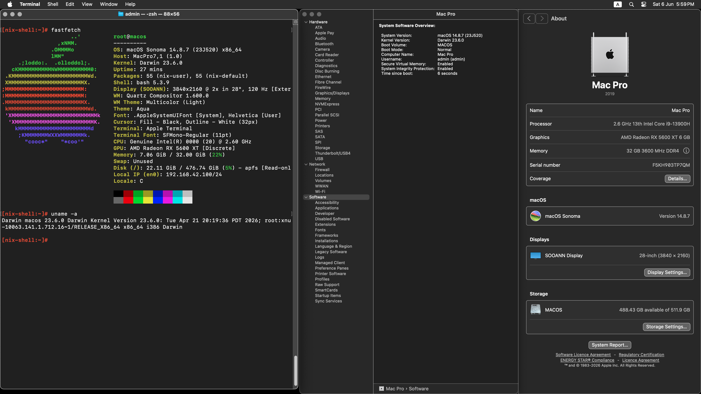

# EFI-Q1HY-OpenCore-Hackintosh

### OpenCore

[OpenCore 1.0.7](https://github.com/acidanthera/OpenCorePkg)

### OS Versions Tested

- macOS Sequoia 15.x
- macOS Sonoma 14.x
- macOS Ventura 13.x

### Hardware

- Motherboard: TIANBANG/SHANDIAN Z790I Plus
- Bios Version: Leo BIOS v1.5
- CPU: 13900HK (ES) -- Code Name: Q1HY
- GPU: AMD RADEON RX 6750GRE 12G / 5600XT 6G
- Audio: Realtek ALC897
- Ethernet: Realtek RTL8111 PCle 1GbE Family Controller
- Ethernet: Realtek RTL8125 PCle 2.5GbE Family Controller
- Wireless: Intel Wi-Fi AX210

### GPU

I have tested with two GPUs:

[6750GRE](EFI-6750GRE)

[5600XT](EFI-5600XT)

- For 6750GRE, it need [NootRX](https://github.com/ChefKissInc/NootRX) kext.
- For 5600XT, it just works fine without any extra kext.

### PS:

- All USB ports are customized well and could use USB3.0 at boot stage ( also works at installing stage ).
- (Also include the extended USB2.0 9PIN & USB3.0 19PIN & Type-E 19PIN on the motherboard)
- 
- Wireless Connection & Bluetouch works in Sonoma & Ventura.
- (Currently in Sequoia unable works, but may use [HeliPort](https://github.com/OpenIntelWireless/heliport) instead.)
- 
- So the recommended macOS version is latest Sonoma.

### Screenshot

### Disclaimer

~~~
THE EFI is provided "AS IS".
Use at your own risk. No warranty.
~~~

### Acknowledgement

- https://github.com/hackintosh-club/TianBang-13900H-ES-ITX-OpenCore
- https://github.com/igeekbb/TianBang-13900H-ES-ITX-OpenCore
- https://github.com/ou8zz/Q1HY-13900HES-Ventura

**And thanks to all the open-source projects used by this repo!**
